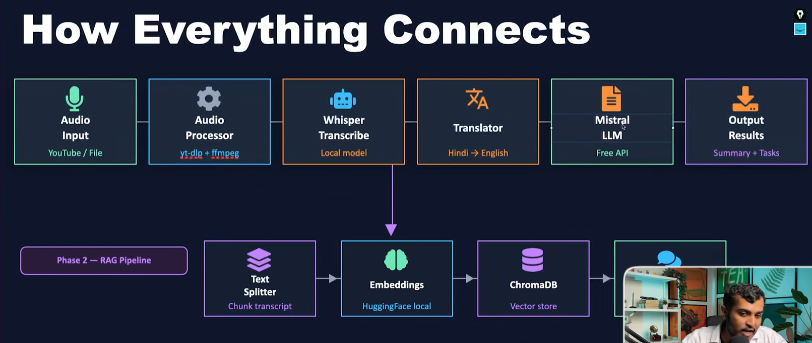
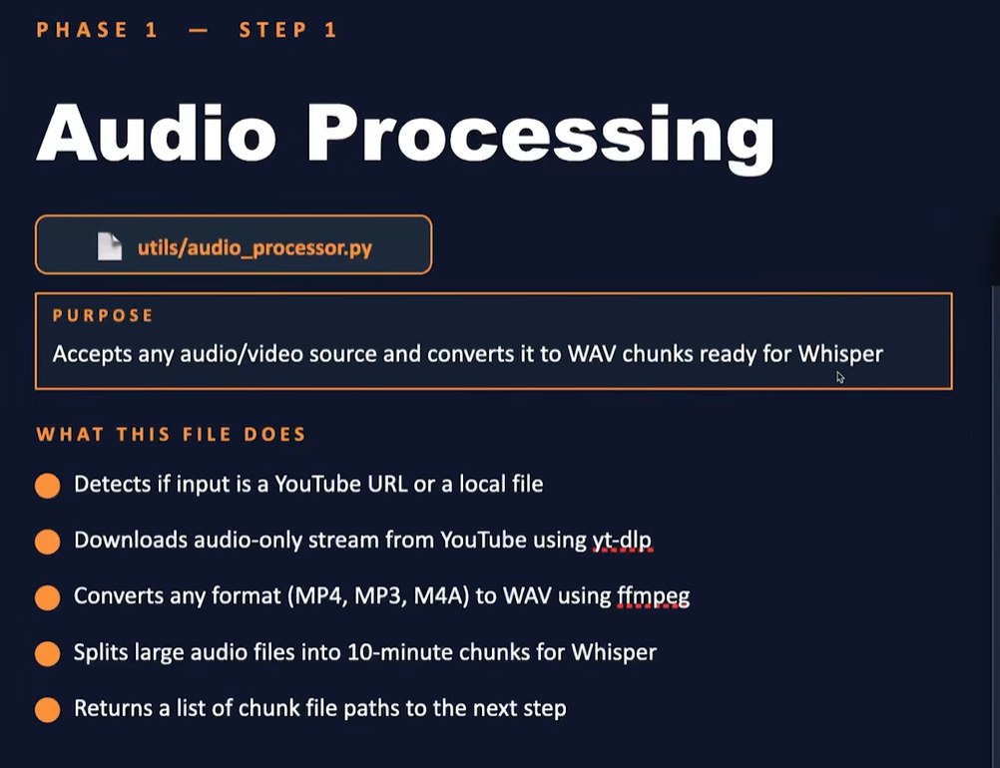

# ai-video-assistant

[//]: # (Packages)
1. pydub
   - Download Dependencies
     - Run Command: winget install --id=Gyan.FFmpeg -e --source=winget
- t lets you load, slice, edit, and export audio files using an easy interface, with FFmpeg handling the heavy lifting. It’s widely used for tasks like trimming audio, adjusting volume, adding effects, and converting between formats.

Step 1
Download videos (from youtube or any other source, in .wav format)
        |
Change the khz and channel rate to 16k (to use Wishper AI)
        |
Chunk wav audio (10 min per chunk)

Step 2: AI Transcription (Will Run OpenAI Whisper locally to convert audio chunks into text
Install:
    - pip install whisper
WHAT THIS FILE DOES
- Loads the Whisper model once into memory (tiny/small/medium/large)
- Transcribes each audio chunk one by one
- Supports translate mode — converts Hindi speech directly to English text
- Combines all chunk transcripts into one single clean transcript
- Model size is configurable via .env — balances speed vs accuracy
Cons
- Whisper don't work for hindi translation properly we we can use SARVAM MODEL for that 

# FLOW
Download videos (from youtube or any other source, in .wav format)
        |
Change the khz and channel rate to 16k (to use Wishper AI)
        |
Chunk wav audio (10 min per chunk)
        |
AI Transcription (core/transcriber.py) translating audio to text
        |
summerize

E:\Rajiv_Workspace\My_Development\Practice\GenAI\sheriyansYT\Projects\ai-video-assistant\.venv312\Lib\site-packages\whisper\transcribe.py:132: UserWarning: FP16 is not supported on CPU; using FP32 instead
  warnings.warn("FP16 is not supported on CPU; using FP32 instead")